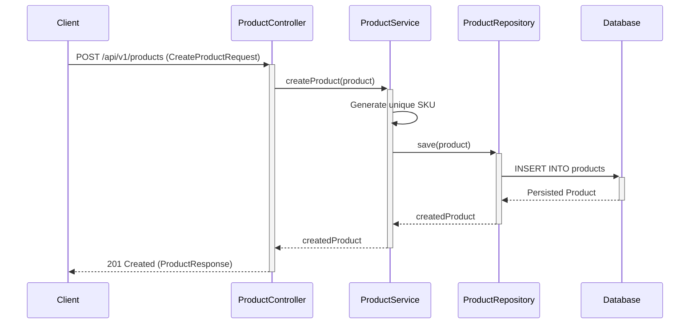
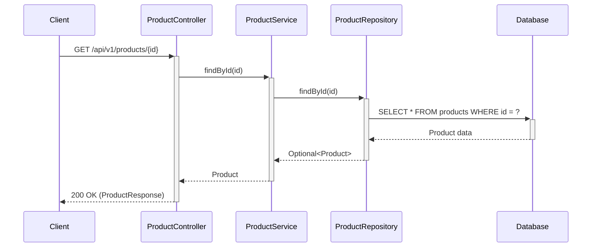

# System Architecture Analysis

## 1. High-Level Overview

The Product Catalog API is a classic three-tier Spring Boot application designed to manage product data. The architecture follows a clean separation of concerns, with distinct layers for presentation, business logic, and data access. This layered approach promotes modularity, making the system easier to develop, test, and maintain.

The application is built with Java 21 and Spring Boot 3, leveraging modern features of the framework. It is designed to be run in a containerized environment using Docker, with PostgreSQL as the database.

## 2. Component Interactions

The system is composed of the following key components:

-   **`ProductController` (Presentation Layer)**: Exposes the REST API endpoints for product management. It receives HTTP requests, validates the input using DTOs, and delegates the processing to the `ProductService`.
-   **`ProductService` (Business Logic Layer)**: Contains the core business logic of the application. It orchestrates the creation, retrieval, and management of products, including generating unique SKUs and ensuring transactional integrity.
-   **`ProductRepository` (Data Access Layer)**: Manages all interactions with the PostgreSQL database. It extends Spring Data JPA's `JpaRepository`, providing standard CRUD operations and custom queries for finding products.
-   **`Product` (Model)**: Represents the JPA entity for a product, mapping directly to the `products` table in the database.
-   **DTOs (`CreateProductRequest`, `ProductResponse`)**: Data Transfer Objects used to separate the API's public contract from the internal data model. This ensures that the API remains stable even if the underlying database schema changes.
-   **`GlobalExceptionHandler`**: A centralized exception handler that catches and processes exceptions thrown by the application, returning consistent and meaningful error responses to the client.

## 3. Data Flow Diagrams

### Create Product

### Get Product by ID

## 4. Design Decisions and Rationale

-   **Layered Architecture**: The choice of a three-layer architecture (Presentation, Service, Data Access) is a standard and effective pattern for building enterprise applications. It promotes a clear separation of concerns, making the codebase more modular, testable, and maintainable.
-   **DTOs for API Contracts**: Using DTOs to define the API's request and response payloads decouples the public API from the internal data model. This allows the database schema to evolve without breaking the API contract, providing a stable interface for clients.
-   **Transactional Service Layer**: All business logic that modifies the database is encapsulated within the `ProductService` and marked as `@Transactional`. This ensures that all database operations are atomic, maintaining data integrity and consistency.
-   **Spring Data JPA**: Leveraging Spring Data JPA for the data access layer simplifies database interactions by providing a high-level abstraction over JDBC and boilerplate code. This allows developers to focus on business logic rather than low-level data access details.
-   **Containerization with Docker**: The entire application stack, including the PostgreSQL database, is designed to be run in Docker containers. This provides a consistent and reproducible environment for development, testing, and deployment.

## 5. System Constraints and Limitations

-   **Scalability**: The current architecture is a single monolithic application. While it can be scaled horizontally by running multiple instances, a microservices architecture might be more suitable for very large-scale deployments.
-   **Authentication and Authorization**: The API does not currently implement any authentication or authorization mechanisms. In a production environment, this would be a critical requirement to secure the API.
-   **Database**: The system is designed to work with a relational database (PostgreSQL). While it could be adapted to other databases, this would require changes to the data access layer and potentially the Flyway migration scripts.
